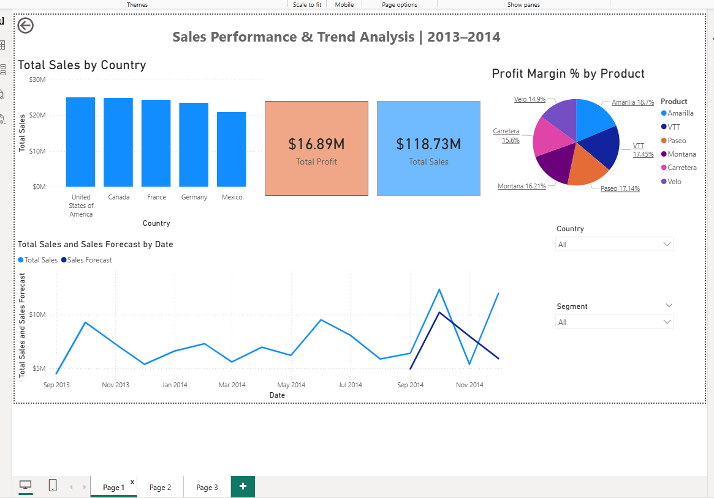
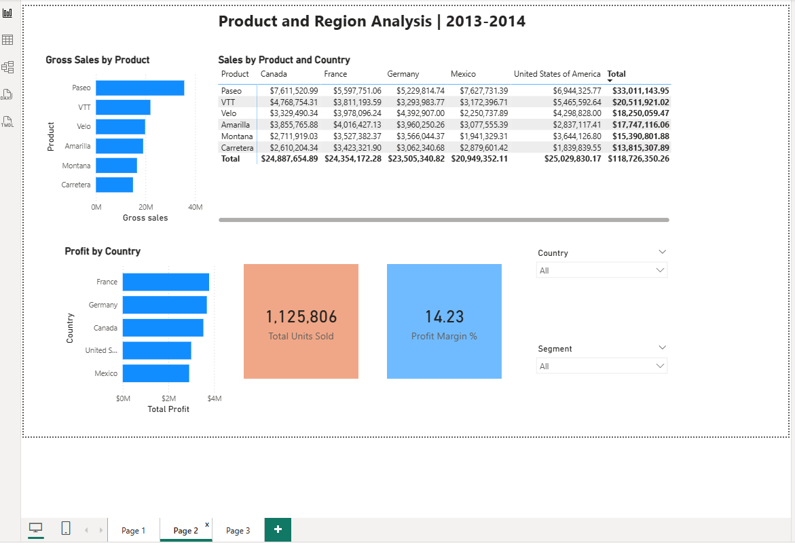
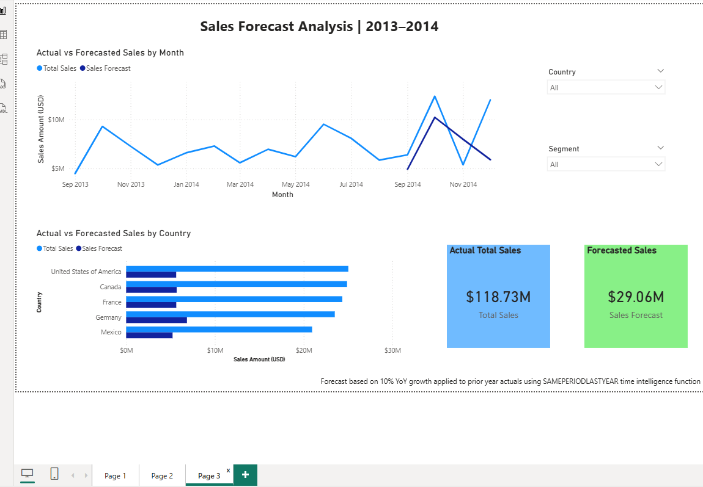

# Sales Performance and Trend Analysis

A multi-page interactive Power BI dashboard analyzing historical 
sales data to uncover revenue trends, profitability patterns, 
and forecast future growth.

## Overview
This project analyzes the Microsoft Financial Sample dataset 
to evaluate sales performance across products, regions, and 
customer segments across 2013-2014. The dashboard enables 
business stakeholders to make data-driven decisions through 
interactive visualizations and forward-looking forecasts 
across three dedicated report pages.

## Tools & Technologies
- **Power BI Desktop** — dashboard development and visualization
- **DAX** — custom measures, KPIs, and time intelligence
- **Power Query** — data transformation and cleaning
- **Excel** — source data (Microsoft Financial Sample)

## Data Model
- Built a **star schema** with a dedicated Date Table 
  created using `CALENDARAUTO()` and marked as Date Table
- Established one-to-many relationships between 
  Date Table and fact table
- Organised DAX measures into display folders 
  (Sales and Profit) for clean model structure

## DAX Measures Created

### Sales Folder
```dax
Total Sales = SUM(financials[Sales])

Total Gross Sales = SUM(financials[Gross Sales])

Total Units Sold = SUM(financials[Units Sold])

Sales Forecast = 
VAR LastYearSales = 
    CALCULATE(
        [Total Sales], 
        SAMEPERIODLASTYEAR('Date Table'[Date])
    )
RETURN 
    IF(
        ISBLANK(LastYearSales),
        BLANK(),
        LastYearSales * 1.1
    )
```

### Profit Folder
```dax
Total Profit = SUM(financials[Profit])

Profit Margin % = DIVIDE([Total Profit], [Total Sales]) * 100
```

## Dashboard Pages

### Page 1 — Executive Summary
High-level overview of overall sales performance:
- KPI cards — Total Sales ($118.73M) and 
  Total Profit ($16.89M)
- Bar chart — Total Sales by Country
- Pie chart — Profit Margin % by Product
- Line chart — Actual vs Forecasted Sales by Date
- Interactive dropdown slicers — Country and Segment

### Page 2 — Product & Region Analysis
Detailed breakdown of product and regional performance:
- Bar chart — Gross Sales by Product
- Bar chart — Profit by Country
- Matrix — Sales by Product and Country with totals
- KPI cards — Total Units Sold (1,125,806) 
  and Profit Margin % (14.23%)
- Interactive dropdown slicers — Country and Segment

### Page 3 — Sales Forecast Analysis
Forward-looking revenue projections:
- Line chart — Actual vs Forecasted Sales by Month
- Bar chart — Actual vs Forecasted Sales by Country
- KPI cards — Actual Total Sales ($118.73M) 
  and Forecasted Sales ($29.06M)
- Methodology note explaining forecast assumptions

## Key Insights
- **United States of America** generates the highest 
  total sales across all countries
- **Paseo** is the top-selling product by gross sales 
  ($33M total)
- **France** leads in total profit by country
- **Amarilla** has the highest profit margin at 18.7%
- Sales peak observed in **October 2014** - highest 
  monthly revenue in the dataset
- Forecast projects **10% YoY growth** for Sep-Nov 2014 
  based on prior year actuals using SAMEPERIODLASTYEAR 
  time intelligence

## Sales Forecasting Methodology
```dax
Sales Forecast = 
VAR LastYearSales = 
    CALCULATE(
        [Total Sales], 
        SAMEPERIODLASTYEAR('Date Table'[Date])
    )
RETURN 
    IF(
        ISBLANK(LastYearSales),
        BLANK(),
        LastYearSales * 1.1
    )
```
A 10% annual growth rate was applied based on the 
average year-over-year growth observed in the dataset. 
The forecast only displays for periods where a full 
year of baseline data exists (Sep–Nov 2014), ensuring 
projections are grounded in real data rather than 
assumptions.

## Dashboard Screenshots

### Page 1 — Executive Summary


### Page 2 — Product & Region Analysis


### Page 3 — Sales Forecast Analysis


## Dataset
**Source:** Microsoft Financial Sample (publicly available)
**Period:** September 2013 — November 2014
**Key columns:** Date, Product, Segment, Country, 
Sales, Gross Sales, COGS, Profit, Discount Band, 
Units Sold

## How to Use
1. Clone this repository
2. Download `Financial_Sample.xlsx` from the `/Data` folder
3. Open the `.pbix` file from the `/Reports` folder 
   in Power BI Desktop
4. Explore the interactive dashboard across all 3 pages
5. Use Country and Segment slicers to filter data

## Repository Structure
PowerBI-Projects/
├── Projects/
│   └── Sales-Performance-Analysis/
│       ├── Data/
│       │   └── Financial_Sample.xlsx
│       ├── Reports/
│       │   └── Sales_Performance_Analysis.pbix
│       ├── Images/
│       │   ├── Page1_Executive_Summary.png
│       │   ├── Page2_Product_Region.png
│       │   └── Page3_Sales_Forecast.png
│       └── README.md

## Author
**Vijayalakshmi Veeraiyan**
- LinkedIn: [linkedin.com/in/vijayalakshmi-veeraiyan]
- GitHub: [github.com/Viji-Veer]
- Email: imvijee@gmail.com
